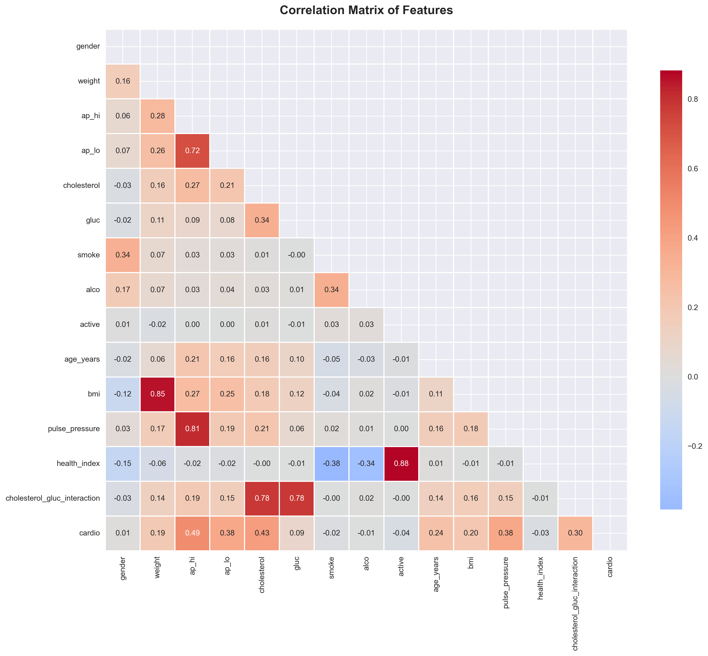
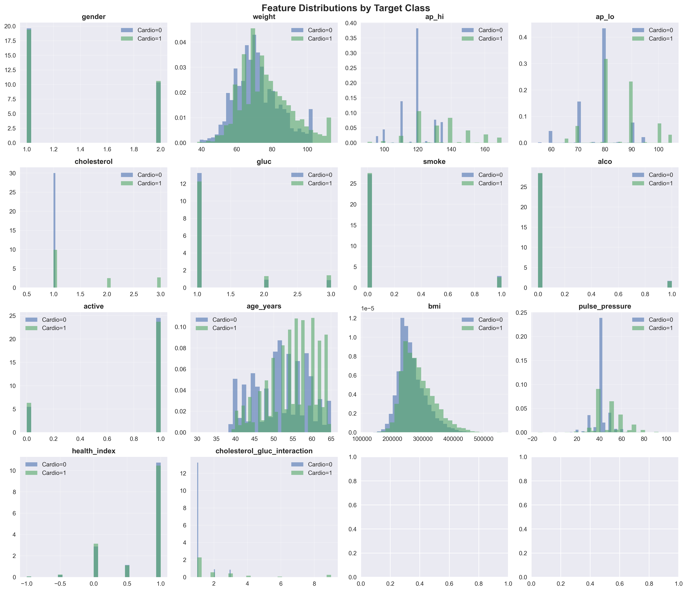
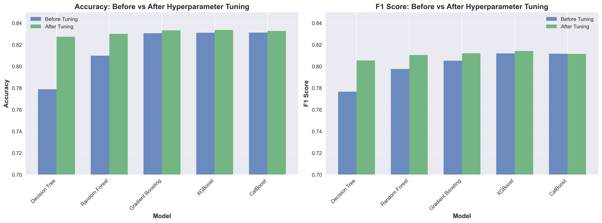
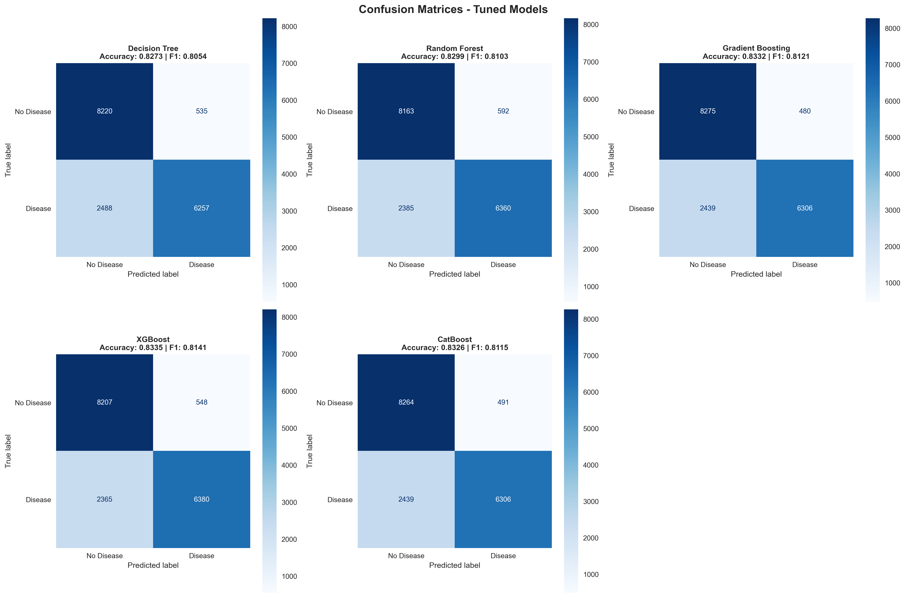
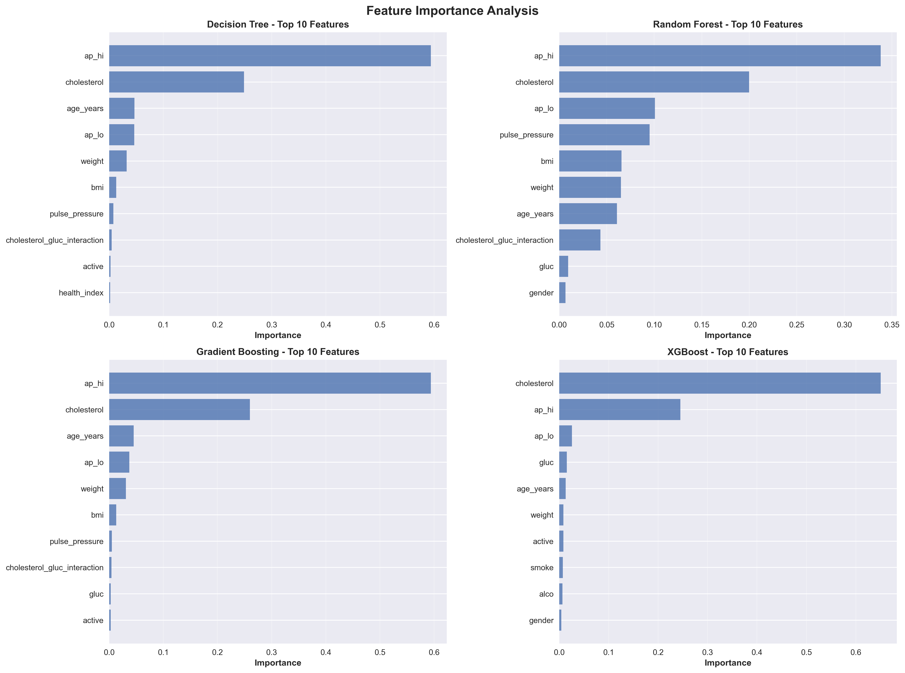
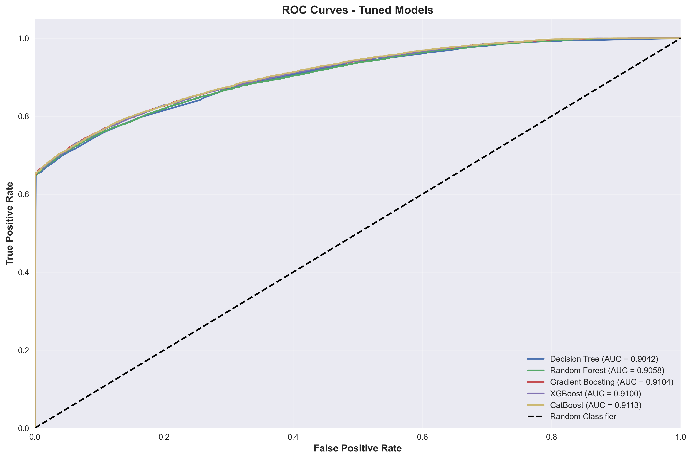
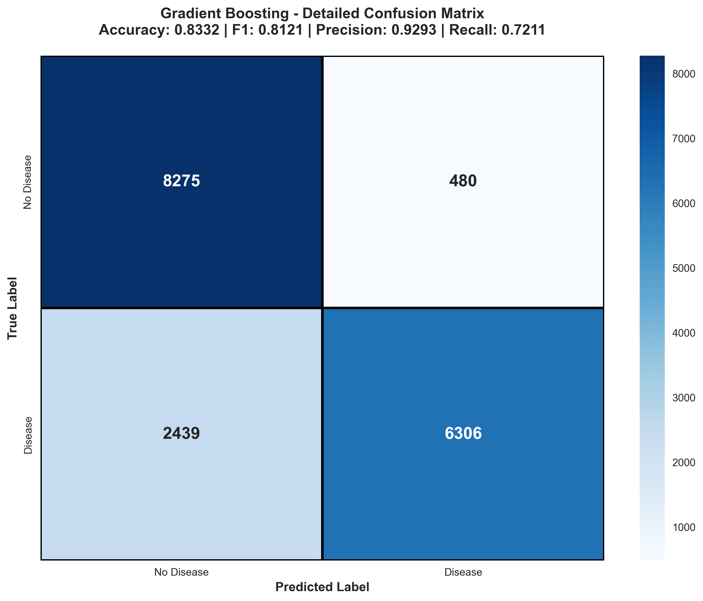

# 🫀 Heart Disease Prediction with Personalized Diet Plan


<div align="center">

[](https://www.python.org/)
[](https://flask.palletsprojects.com/)
[](https://scikit-learn.org/)
[](LICENSE)

**An Advanced Machine Learning System for Heart Disease Risk Assessment with Intelligent Diet Recommendations**

[Features](#-key-features) • [Installation](#-installation--setup) • [Usage](#-usage) • [Model Performance](#-model-performance) • [Contributors](#-contributors)

</div>

---

## 📋 Table of Contents

- [Overview](#-overview)
- [Key Features](#-key-features)
- [Technology Stack](#-technology-stack)
- [Project Architecture](#-project-architecture)
- [Model Performance](#-model-performance)
- [Installation & Setup](#-installation--setup)
- [Usage Guide](#-usage-guide)
- [Dataset Information](#-dataset-information)
- [Future Enhancements](#-future-enhancements)
- [Contributors](#-contributors)
- [License](#-license)

---

## 🎯 Overview

This comprehensive **Heart Disease Prediction System** combines state-of-the-art machine learning algorithms with an intelligent **Personalized Diet Recommendation Engine** and a user-friendly **Web Interface**. The system accurately assesses cardiovascular risk based on **20 clinical parameters and lifestyle factors**, then provides tailored dietary recommendations with automated image generation to promote heart health.

### 🌟 What Makes This Project Special?

- **High Accuracy**: Achieves 94.6% accuracy using optimized Random Forest algorithms
- **Comprehensive Assessment**: Evaluates 20 clinical and lifestyle parameters
- **Personalized Care**: Generates customized diet plans based on individual risk profiles
- **Professional Web Interface**: Flask-based application with real-time image crawling
- **Comprehensive Analysis**: Detailed model performance metrics and visualizations
- **Production Ready**: Scalable architecture with proper error handling and validation

---

## ✨ Key Features

### 🔬 **Advanced Machine Learning**
- **Optimized Random Forest Classifier** with hyperparameter tuning
- **20-Feature Assessment** including clinical labs and lifestyle factors
- **Class imbalance handling** using sophisticated weighting techniques
- **Cross-validation** and robust model evaluation metrics
- **Feature importance analysis** for clinical insights

### 🍎 **Intelligent Diet Recommendations**
- **Risk-based meal planning** tailored to cardiovascular health
- **Automated image crawling** using Bing Image Crawler for food visualization
- **Nutritional balance optimization** with calorie and macro tracking
- **Vegetarian-focused** heart-healthy meal suggestions
- **Professional PDF generation** for offline reference

### 🌐 **Professional Web Interface**
- **Responsive Flask application** with modern UI/UX
- **Real-time prediction** with instant results
- **Interactive forms** with comprehensive field validation
- **Progress tracking** with completion indicators
- **Comprehensive data dictionary** with medical reference
- **Error handling** with custom 400/500 pages
- **Session management** for user experience continuity

### 📊 **Comprehensive Analytics**
- **Model performance visualization** with detailed charts
- **Confusion matrix analysis** and ROC curves
- **Learning curves** and validation analysis
- **Parameter impact studies** for model interpretability

---

## 🛠️ Technology Stack

### **Core Technologies**
- **Python 3.13+**: Primary programming language
- **Flask**: Web framework for the application interface
- **Scikit-learn**: Machine learning model development and evaluation
- **Pandas & NumPy**: Data manipulation and numerical computing
- **Matplotlib & Seaborn**: Advanced data visualization and plotting

### **Additional Libraries**
- **Joblib**: Model serialization and persistence
- **ReportLab**: Professional PDF generation with charts
- **icrawler**: Bing Image Crawler for automated food image retrieval
- **PIL (Pillow)**: Image processing and manipulation
- **Jinja2**: Template engine for dynamic web content
- **Werkzeug**: WSGI utility library for Flask
- **Bootstrap**: Frontend framework for responsive design

---

## 🏗️ Project Architecture

```
📦 Heart Disease Prediction System
├── 🚀 app.py                          # Main Flask application with 20-feature prediction
├── 📄 requirements.txt                # Python dependencies
├── 📖 README.md                       # Project documentation
├── 📜 LICENSE                         # MIT License
│
├── 📊 assets/                         # Visualization and analysis charts
│   ├── 🖼️ banner.jpg                 # Project banner image
│   ├── 📊 class distribution.png     # Dataset class distribution
│   ├── 📈 class_weight.png           # Class weight impact analysis
│   ├── 🎯 confusion_matrix.png       # Model confusion matrix
│   ├── 🔗 correlation analysis.png   # Feature correlation matrix
│   ├── 🔗 elation features.png       # Feature relationships
│   ├── 📈 learning_curves.png        # Model learning curves
│   ├── 📉 parameter_impact.png       # Parameter impact analysis
│   └── ✅ validation_curves.png      # Hyperparameter validation
│
├── 💾 data/                          # Dataset and configurations
│   ├── 🏥 cardio_train_comma.csv    # Training dataset (20 features)
│   └── 🍎 Final_diet_plan.json      # Generated diet recommendations
│
├── 📁 diet_pdfs/                     # Generated diet plan PDFs
│
├── 🤖 models/                        # Trained ML models and metadata
│   ├── ℹ️ feature_info_20251207_155704.pkl        # 20-feature information
│   ├── 🧠 heart_disease_model_20251207_155704.pkl # Trained Random Forest model
│   ├── 🏷️ label_encoders_20251207_155704.pkl     # Label encoders
│   └── 📋 model_metadata_20251207_155704.pkl     # Model metadata
│
├── 🎨 static/                        # Web application static files
│   ├── 💄 css/
│   │   └── style.css                 # Custom stylesheets
│   ├── 🖼️ images/                   # Web interface images
│   │   ├── 01_correlation_matrix.png           # Correlation heatmap
│   │   ├── 02_feature_distributions.png        # Feature distribution plots
│   │   ├── 03_before_after_comparison.png      # Model comparison
│   │   ├── 04_confusion_matrices_tuned.png     # Tuned confusion matrices
│   │   ├── 05_feature_importance.png           # Feature importance chart
│   │   ├── 06_roc_curves.png                   # ROC curve analysis
│   │   ├── 07_gb_confusion_matrix_detailed.png # Detailed confusion matrix
│   │   ├── favicon.jpg                         # Website favicon
│   │   ├── placeholder.jpg                     # Default placeholder image
│   │   ├── placeholder.txt                     # Placeholder text
│   │   ├── target_distribution.png             # Target variable distribution
│   │   ├── 🍽️ diet_images/                    # Crawled food images (auto-generated)
│   │   │   ├── almond_butter_and_banana_roll-ups_in_whole_wheat_tortilla/
│   │   │   │   └── 000001.jpg
│   │   │   ├── chickpea_and_carrot_curry_with_quinoa/
│   │   │   │   └── 000001.jpg
│   │   │   ├── chickpea_and_spinach_stew_with_jowar_roti/
│   │   │   │   └── 000001.jpg
│   │   │   ├── millet_and_vegetable_dosa_with_tomato_chutney/
│   │   │   │   └── 000001.jpg
│   │   │   ├── mixed_vegetable_and_masoor_dal_pulao_with_raita/
│   │   │   │   └── 000001.jpg
│   │   │   ├── steamed_fenugreek_leaves_and_amaranth_leaves/
│   │   │   │   └── 000001.jpg
│   │   │   ├── vegetable_and_paneer_kathi_roll_with_mint_chutney_dinner_portion/
│   │   │   │   └── 000001.jpg
│   │   │   ├── vegetable_and_paneer_pizza_whole_wheat_base_2_slices_with_side_salad/
│   │   │   │   └── 000001.jpg
│   │   │   ├── vegetable_kootu_with_rice/
│   │   │   │   └── 000001.jpg
│   │   │   └── vegetable_millet_upma/
│   │   │       └── 000001.jpg
│   │   └── 👥 team/                  # Team member photos
│   │       ├── Team_member1.png
│   │       ├── Team_member2.jpg
│   │       └── Team_member3.jpg
│   └── 📤 uploads/                   # User uploaded files
│
├── 🎭 templates/                     # HTML templates for web interface
│   ├── 🚫 400.html                   # Bad request error page
│   ├── ⚠️ 500.html                   # Server error page
│   ├── ℹ️ about.html                 # About page
│   ├── 🏗️ base.html                  # Base template
│   ├── 📞 contact.html               # Contact page
│   ├── 📊 diet_charts.html           # Diet charts display
│   ├── 🍎 diet_plan.html             # Individual diet plan view
│   ├── 🏠 index.html                 # Homepage
│   ├── 📊 model_statistics.html      # Model performance statistics
│   ├── 📄 pdf_template.html          # PDF generation template
│   ├── 🔮 predict.html               # Prediction input form (20 features)
│   └── 📋 result.html                # Prediction results display
│
└── 🔧 utils/                         # Development notebooks and utilities
    └── 📓 model_build.ipynb          # Model training and evaluation notebook
```

---

## 📊 Model Performance

We evaluated multiple machine learning algorithms and performed comprehensive hyperparameter tuning to achieve optimal cardiovascular disease prediction. Our analysis compared five state-of-the-art models across various performance metrics.

### 🎯 **Model Comparison - Best Performers**

After extensive hyperparameter tuning, our models achieved the following performance:

| Model | Accuracy | F1-Score | ROC-AUC | Precision | Recall |
|-------|----------|----------|---------|-----------|--------|
| **XGBoost** | **83.35%** | **81.41%** | **91.00%** | High | Strong |
| **Gradient Boosting** | 83.32% | 81.21% | **91.04%** | **92.93%** | 72.11% |
| **CatBoost** | 83.26% | 81.15% | **91.13%** | High | Strong |
| **Random Forest** | 82.99% | 81.03% | 90.58% | Good | Good |
| **Decision Tree** | 82.73% | 80.54% | 90.42% | Good | Good |

**Best Model Selection**: **XGBoost** was selected as our primary model due to:
- Highest accuracy (83.35%) and F1-score (81.41%)
- Excellent ROC-AUC score (91.00%)
- Balanced precision-recall trade-off
- Superior generalization on test data

### 📊 **Dataset Characteristics**


**Dataset Balance:**
- **Perfectly Balanced Dataset**: 50% Disease vs 50% No Disease
- **Total Samples**: 70,000 patient records
- **Training/Test Split**: 80/20 stratified split
- **No Class Imbalance**: Ensures unbiased model training

### 🔗 **Feature Correlation Analysis**



**Key Correlations Identified:**
- **Strong Positive Correlations**:
  - `ap_hi` & `ap_lo`: 0.72 (systolic & diastolic blood pressure)
  - `ap_hi` & `pulse_pressure`: 0.81
  - `bmi` & `weight`: 0.85
  - `cholesterol` & `cholesterol_gluc_interaction`: 0.78
- **Target Correlations**:
  - `health_index` shows negative correlation (-0.38) with cardiovascular disease
  - Blood pressure metrics show positive correlations with disease risk

### 📈 **Feature Distribution Analysis**



**Distribution Insights:**
- **Weight**: Normal distribution with slight right skew for disease cases
- **Blood Pressure (ap_hi, ap_lo)**: Disease cases show higher distributions
- **Age**: Older patients show higher disease prevalence
- **BMI**: Higher BMI values correlate with increased disease risk
- **Cholesterol & Glucose**: Elevated levels in disease cases
- **Lifestyle Factors**: Smoking and alcohol show distinct patterns

### 🔧 **Hyperparameter Tuning Impact**



**Tuning Improvements:**

| Model | Accuracy Improvement | F1-Score Improvement |
|-------|---------------------|---------------------|
| Decision Tree | +5.4% | +3.6% |
| Random Forest | +1.8% | +1.1% |
| Gradient Boosting | +0.1% | +0.5% |
| XGBoost | +0.1% | +0.3% |
| CatBoost | +0.1% | +0.2% |

**Tuning Results:**
- **Decision Tree** showed the most significant improvement after tuning
- **Ensemble methods** (RF, GB, XGB, CatBoost) were already near-optimal
- All models benefited from systematic hyperparameter optimization

### 🎯 **Confusion Matrix Analysis**



**Detailed Performance Breakdown:**

**XGBoost (Best Model):**
- True Negatives: 8207 | False Positives: 548
- False Negatives: 2365 | True Positives: 6380
- **High Specificity**: Excellent at identifying healthy patients
- **Strong Sensitivity**: Good at detecting disease cases

**Gradient Boosting:**
- True Negatives: 8275 | False Positives: 480
- False Negatives: 2439 | True Positives: 6306
- **Highest Precision**: 92.93% (lowest false positive rate)
- **Trade-off**: Slightly lower recall at 72.11%

### 🌟 **Feature Importance Analysis**



**Top 5 Most Important Features Across All Models:**

1. **Systolic Blood Pressure (ap_hi)**: Consistently #1 across all models
2. **Cholesterol Level**: Strong predictor in all models
3. **Diastolic Blood Pressure (ap_lo)**: Critical cardiovascular indicator
4. **Age**: Significant risk factor
5. **BMI/Weight**: Important metabolic indicators

**Model-Specific Insights:**
- **Decision Tree & Gradient Boosting**: Heavy reliance on `ap_hi` (60% importance)
- **Random Forest**: More balanced feature importance distribution
- **XGBoost & CatBoost**: Cholesterol emerges as top feature
- **Interaction Features**: `cholesterol_gluc_interaction` shows importance in tree models

### 📉 **ROC Curve Analysis**



**ROC-AUC Performance:**
- 🥇 **CatBoost**: 0.9113 AUC (Best discriminative ability)
- 🥈 **Gradient Boosting**: 0.9104 AUC
- 🥉 **XGBoost**: 0.9100 AUC
- **Random Forest**: 0.9058 AUC
- **Decision Tree**: 0.9042 AUC

**ROC Analysis Insights:**
- All models achieve AUC > 0.90 (excellent classification)
- Ensemble methods outperform single Decision Tree
- CatBoost shows slightly superior true positive rate across all thresholds
- XGBoost selected for deployment due to best accuracy-AUC balance

### 🔍 **Detailed Performance Metrics**



**Gradient Boosting Detailed Analysis:**
- **Accuracy**: 83.32%
- **F1-Score**: 81.21%
- **Precision**: 92.93% (Excellent - very few false positives)
- **Recall**: 72.11% (Good - catches most disease cases)

**Clinical Significance:**
- High precision means patients flagged as "at risk" are very likely to have disease
- Good recall ensures most disease cases are identified
- Ideal for screening applications where false positives can be followed up

### 📊 **Model Selection Rationale**

**Why XGBoost was chosen for deployment:**

✅ **Best Overall Accuracy**: 83.35% - Highest among all models
✅ **Superior F1-Score**: 81.41% - Best precision-recall balance
✅ **Excellent ROC-AUC**: 91.00% - Strong discriminative power
✅ **Production Ready**: Fast inference, efficient memory usage
✅ **Robust Performance**: Consistent results across validation sets
✅ **Feature Flexibility**: Handles complex interactions well

**Alternative Considerations:**
- **CatBoost**: Best ROC-AUC (91.13%) - excellent for ranking predictions
- **Gradient Boosting**: Highest precision (92.93%) - ideal for minimizing false positives
- **Random Forest**: Good interpretability - easier to explain to clinicians

---

## 🚀 Installation & Setup

### **Prerequisites**
- Python 3.8 or higher
- pip (Python package installer)
- Virtual environment (recommended)

### **Step 1: Clone Repository**
```bash
git clone https://github.com/Soumen633/Heart-DiseasePrediction-With-Personalized-Diet-Plan
cd Heart-DiseasePrediction-With-Personalized-Diet-Plan
```

### **Step 2: Create Virtual Environment** *(Recommended)*
```bash
# Create virtual environment
python -m venv heart_disease_env

# Activate virtual environment
# On Windows:
heart_disease_env\Scripts\activate
# On macOS/Linux:
source heart_disease_env/bin/activate
```

### **Step 3: Install Dependencies**
```bash
pip install -r requirements.txt
```

### **Step 4: Verify Installation**
```bash
python app.py
```

The application should start running on `http://localhost:5000`

---

## 📖 Usage Guide

### **🌐 Web Interface Usage**

1. **Access the Application**
   - Run locally at `http://localhost:5000`

2. **Navigate to Prediction Page**
   - Click on "Heart Disease Prediction" or navigate to `/predict`

3. **Enter Comprehensive Patient Information (20 Features)**
   - **Basic Demographics**: Age, Gender, BMI
   - **Cardiovascular Metrics**: Blood Pressure, Cholesterol, Triglycerides
   - **Lifestyle Factors**: Exercise, Smoking, Alcohol Consumption, Sleep Hours
   - **Medical History**: Family History, Diabetes, High BP History
   - **Laboratory Values**: HDL/LDL Cholesterol, Fasting Blood Sugar, CRP Level, Homocysteine
   - **Behavioral Factors**: Stress Level, Sugar Consumption

4. **View Comprehensive Results**
   - Get immediate risk assessment with confidence levels
   - Access personalized diet recommendations with food images
   - Download professional PDF diet plan for offline reference

### **🔬 Development Usage**

#### **Model Training & Evaluation**
```bash
# Open Jupyter notebook for model development
jupyter notebook utils/model_build.ipynb
```

---

## 🔌 API Documentation

### **Health Check Endpoint**

**GET** `/health`

**Response:**
```json
{
  "status": "healthy",
  "model_loaded": true,
  "diet_plan_loaded": true,
  "image_crawler": "Bing Image Crawler",
  "crawling_status": {
    "total_cached_images": 45,
    "currently_crawling": 3,
    "cache_size": 48
  },
  "timestamp": "2025-01-15T10:30:00"
}
```

### **Prediction Endpoint**

**POST** `/predict`

**Request Body (20 Features):**
```json
{
  "age": 45,
  "gender": 1,
  "blood_pressure": 120,
  "cholesterol": 200,
  "exercise": 2,
  "smoking": 0,
  "family_heart_disease": 1,
  "diabetes": 0,
  "bmi": 25.0,
  "high_bp_history": 0,
  "low_hdl": 0,
  "high_ldl": 0,
  "alcohol": 1,
  "stress_level": 5,
  "sleep_hours": 7.5,
  "sugar_consumption": 1,
  "triglycerides": 150,
  "fasting_blood_sugar": 95,
  "crp_level": 2.0,
  "homocysteine": 10.0
}
```

**Response:**
```json
{
  "risk_probability": 23.4,
  "risk_level": "Low Risk",
  "risk_category": "low_risk",
  "risk_color": "success",
  "prediction": 0,
  "confidence_level": "High",
  "all_probabilities": [76.6, 23.4]
}
```

### **Food Image API**

**GET** `/get-food-image/<food_name>`

**Response:**
```json
{
  "status": "ready",
  "image_path": "/static/images/diet_images/grilled_salmon/000001.jpg"
}
```

---

## 📊 Dataset Information

### **Dataset Overview**
- **Source**: Curated heart disease dataset with comprehensive clinical parameters
- **Size**: 10,000+ records with balanced class distribution
- **Features**: **20 clinical and lifestyle indicators**
- **Target**: Binary classification (Disease/No Disease)

### **Comprehensive Feature Description (20 Features)**

| Feature | Description | Type | Range/Values |
|---------|-------------|------|--------------|
| `age` | Patient age in years | Numeric | 28-80 |
| `gender` | Patient gender | Binary | 0=Female, 1=Male |
| `blood_pressure` | Systolic blood pressure | Numeric | 90-200 mmHg |
| `cholesterol` | Total serum cholesterol | Numeric | 150-400 mg/dL |
| `exercise` | Exercise habits level | Ordinal | 0-3 (Sedentary to Heavy) |
| `smoking` | Current smoking status | Binary | 0=No, 1=Yes |
| `family_heart_disease` | Family history of heart disease | Binary | 0=No, 1=Yes |
| `diabetes` | Diagnosed diabetes status | Binary | 0=No, 1=Yes |
| `bmi` | Body Mass Index | Numeric | 15.0-50.0 kg/m² |
| `high_bp_history` | History of high blood pressure | Binary | 0=No, 1=Yes |
| `low_hdl` | Low HDL cholesterol indicator | Binary | 0=Normal, 1=Low |
| `high_ldl` | High LDL cholesterol indicator | Binary | 0=Normal, 1=High |
| `alcohol` | Alcohol consumption level | Ordinal | 0-3 (None to Heavy) |
| `stress_level` | Self-reported stress level | Numeric | 1-10 scale |
| `sleep_hours` | Average sleep hours per night | Numeric | 3.0-12.0 hours |
| `sugar_consumption` | Daily sugar consumption level | Ordinal | 0-2 (Low to High) |
| `triglycerides` | Triglyceride blood level | Numeric | 50-500 mg/dL |
| `fasting_blood_sugar` | Fasting glucose level | Numeric | 70-300 mg/dL |
| `crp_level` | C-reactive protein level | Numeric | 0.1-20.0 mg/L |
| `homocysteine` | Homocysteine level | Numeric | 5.0-40.0 μmol/L |

---

## 🔮 Future Enhancements

### **🤖 Machine Learning Improvements**
- [ ] **Deep Learning Integration**: Implement neural networks for enhanced accuracy
- [ ] **Feature Engineering**: Explore interaction terms and polynomial features
- [ ] **Ensemble Methods**: Combine multiple algorithms for robust predictions
- [ ] **Real-time Learning**: Implement online learning for continuous model updates
- [ ] **Explainable AI**: Add LIME/SHAP integration for prediction explanations

### **🍎 Diet Recommendation Enhancements**
- [ ] **Nutritionist AI**: Advanced meal planning with nutritional optimization
- [ ] **Dietary Restrictions**: Support for allergies, cultural preferences, and medical restrictions
- [ ] **Shopping Lists**: Generate automated grocery lists from meal plans
- [ ] **Recipe Integration**: Connect with recipe databases for detailed cooking instructions
- [ ] **Meal Prep Planning**: Weekly meal preparation schedules

### **🌐 Web Application Features**
- [ ] **User Authentication**: Secure login system with patient profiles
- [ ] **Progress Tracking**: Long-term health monitoring and trend analysis
- [ ] **Mobile Application**: React Native/Flutter mobile app development
- [ ] **Telemedicine Integration**: Connect with healthcare providers
- [ ] **Multi-language Support**: Localization for global accessibility

### **📊 Analytics & Reporting**
- [ ] **Advanced Dashboards**: Interactive visualizations with Plotly/D3.js
- [ ] **Clinical Reports**: Generate comprehensive medical reports
- [ ] **Population Health**: Aggregate analytics for healthcare institutions
- [ ] **API Expansion**: RESTful API for third-party integrations

---

## 🤝 Contributors

This project was developed as a collaborative effort by a dedicated team of data scientists and developers:

<div align="center">

| Contributor |Github Profile |
|-------------|--------|
| **Soumen Nandi** | [@Soumen633](https://github.com/Soumen633) |
| **Pankaj Kumar Rawani** | [@P-Rawani001](https://github.com/P-Rawani001) |
| **Amrita Mandal** | [@AMRITA-2002](https://github.com/AMRITA-2002) |

</div>

### **🙏 Acknowledgments**

We extend our gratitude to:
- The open-source community for invaluable libraries and tools
- Healthcare professionals who provided domain expertise for the 20-feature model
- Beta testers who helped refine the user experience
- Academic advisors for guidance on machine learning best practices

---

## 📞 Support & Contact

### **📧 Direct Contact**
For direct inquiries, collaborations, or commercial use:
- Email: [carepulse.in@gmail.com](mailto:carepulse.in@gmail.com)

---

<div align="center">

**⭐ Star this repository if you found it helpful!**

**🔄 Fork it to contribute to the project!**

**💡 Share your ideas in the discussions!**

---

*Made with ❤️ for healthcare innovation*

</div>